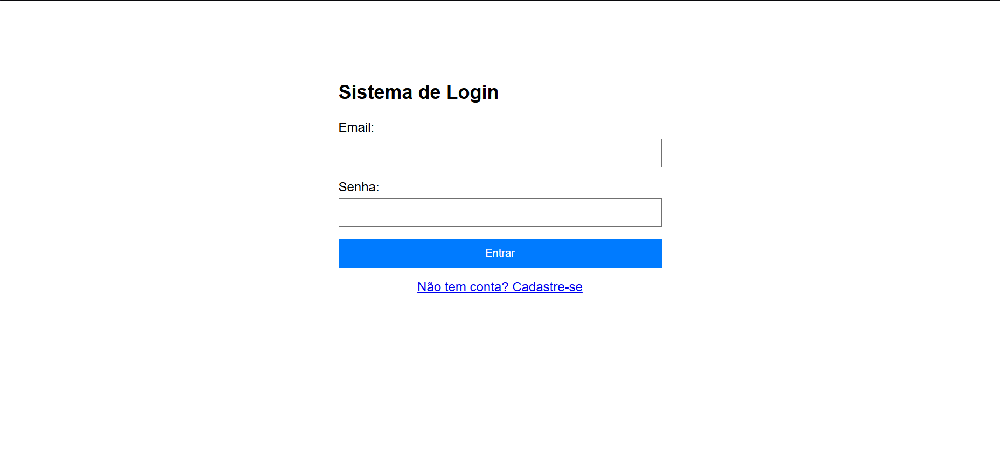
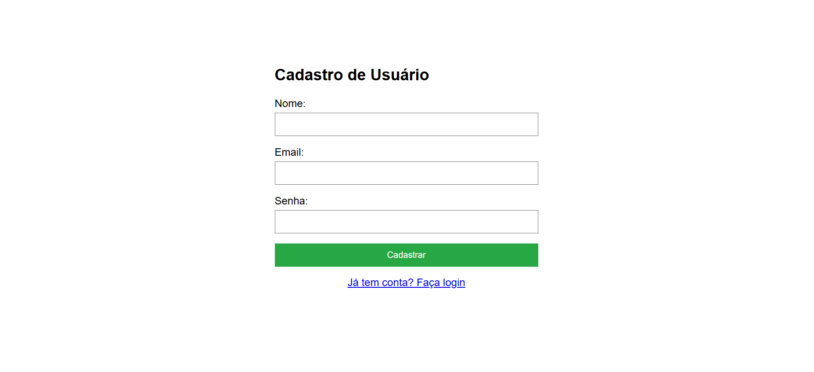

# Spring-boot-login-e-senha
### Esse projeto consiste na utilização da ferramenta de segurança do Framework "Spring-Boot" onde há a busca de usuario e senha para o login, somente podendo acessar outras abas quando o login é efetivado. 
> [!NOTE]
>
> Este sistema foi mais um aprendizado sobre cibersegurança, para aprender a utilizar a ferramenta de login.

# Interface do Sistema
## Aba inicial
O index é apenas o formulário de login para poder acessar o dashboard.

#

## Aba de Cadastro
Área principal para cadastrar o usuário para o banco de dados.

> [!NOTE]
>
> Caso o usuário escreva o email ou a senha errada será alertado o erro na aba de login.

#

## Dashboard
Está aba só pode ser acessada após a sessão de login ser iniciada, sendo impossível de acessar sem. Aqui mostra as informações do usuário. Caso decisa sair, a sessão é encerrada e é necessário fazer o login novamente.

